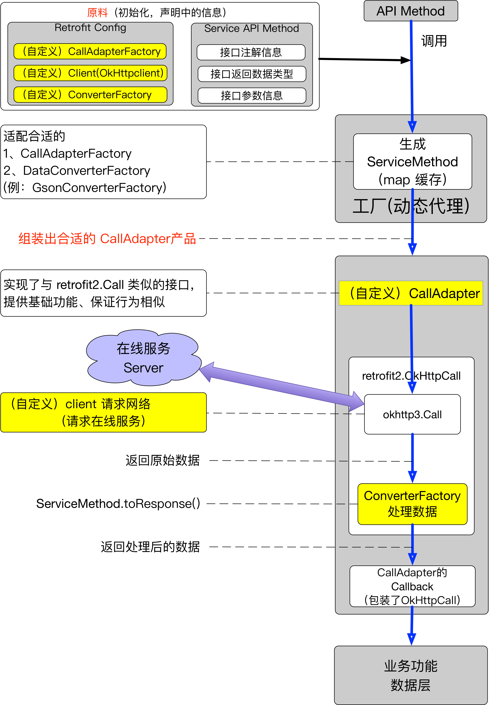

## 源码解读系列（一）：Retrofit 源码重点解读

### Retrofit 源码要点：

1. 设置必要参数，供 ServiceMethod 被调用时使用。

  - BaseUrl 

  - CallAdapterFactory（RxJavaCallAdapter等）

  - ConverterFactory（GsonConverterFactory、FastjsonConverterFactory等）

  - Call.Factory (OkHttpClient)

  - 接口注解、参数、返回值类型的信息

2. 动态代理

  调用顺序：

  - 调用请求网络的"接口方法" ==> 

    动态代理类 ==> 

    生成 ServiceMethod，调用 invoke ==> 

    adapt适配合适的Call并返回给用户使用。

3. ServiceMethod
   - 动态代理类的方法调用返回了由 HttpCallAdapter 包装后的 retrofit2.OkHttpCall，即 HttpCallAdapter。

   - ServiceMethod (寻找合适的CallAdapterFactory) **==>** 

      调用 CallAdapterFactory#adapt 方法，包装下retrofit2.OkHttpCall **==>**

     返回 HttpCallAdapter(实现自定义HttpCall接口，和retrofit2.Call接口的方法相似，保证基础请求功能、行为可用)给 Client 调用端 **==>**

     发送 HttpCallAdapter 到请求队列（HttpCallAdapter.enqueue(自定义 CallBack) **==>**
     retrofit2.OkHttpCall.enqueue(retrofit2.Callback) **==>**

     okhttp3.Call call = serviceMethod.**callFactory**.newCall(**request**) ），最终使用 CallFactory，一般是OkHttpClient，请求网络。

4. retrofit 源码结构、调用流程图
	

如有缺漏不足之处，欢迎创建issue，PR 😄

